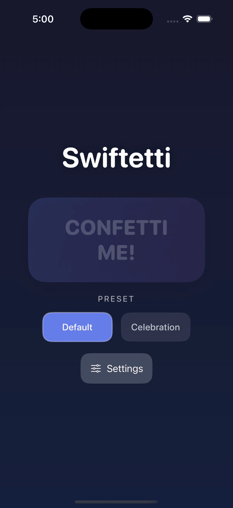

# Swiftetti: The Maximum SwiftUI Confetti Library 🎊

A customizable, high-performance confetti animation library for SwiftUI with realistic physics and metallic effects.


## Demo

### Default Preset
Clean and elegant confetti animation perfect for any celebration moment.

<p align="center">
  
</p>

### Celebration Preset
Explosive burst of colorful particles for those extra special moments.

<p align="center">
  
</p>

### Custom Settings
Fine-tune every aspect of the animation with the interactive settings panel.

<p align="center">
  
</p>

## Features

✨ **Realistic Physics** - Gravity, drag, mass, and wobble effects  
🎨 **Customizable** - Colors, sizes, shapes, and particle counts  
⚡ **High Performance** - Optimized rendering with automatic particle cleanup  
🎭 **Multiple Presets** - Default, Celebration, Subtle, Gold, and Rainbow  
✨ **Metallic Effects** - Optional shimmer and gradient effects  
🎯 **Easy Integration** - Simple SwiftUI API with sensible defaults

## Installation

### Swift Package Manager

Add Swiftetti to your project through Xcode:

1. File → Add Package Dependencies
2. Enter: `https://github.com/fredbenenson/Swiftetti`
3. Click Add Package

Or add to your `Package.swift`:

```swift
dependencies: [
    .package(url: "https://github.com/fredbenenson/Swiftetti", from: "1.0.0")
]
```

## Quick Start

### Basic Usage

```swift
import SwiftUI
import Swiftetti

struct ContentView: View {
    @State private var showConfetti = false
    
    var body: some View {
        Button("Celebrate! 🎉") {
            showConfetti = true
        }
        .overlay {
            SwiftettiView(trigger: $showConfetti)
        }
    }
}
```

### Using Presets

```swift
SwiftettiView(trigger: $showConfetti, preset: .celebration)
```

Available presets:
- `.default` - Standard confetti
- `.celebration` - Lots of colorful particles
- `.subtle` - Fewer, smaller particles
- `.gold` - Metallic gold theme
- `.rainbow` - Rainbow colors

### Custom Colors

```swift
SwiftettiView(
    trigger: $showConfetti,
    colors: [.red, .blue, .green, .yellow]
)
```

### Advanced Customization

```swift
var customSettings = SwiftettiSettings()
customSettings.particleCount = 200
customSettings.gravity = 500
customSettings.metallicEnabled = true
customSettings.colorPalette = [.purple, .pink, .indigo]

SwiftettiView(
    trigger: $showConfetti,
    settings: customSettings
)
```

## Customization Options

### SwiftettiSettings Properties

#### Particle Emission
| Property | Type | Default | Description |
|----------|------|---------|-------------|
| `particleCount` | Int | 150 | Number of particles per burst |
| `maxTotalParticles` | Int | 500 | Performance limit for concurrent particles |

#### Burst Physics
| Property | Type | Default | Description |
|----------|------|---------|-------------|
| `burstSpeedMin` | Double | 2000 | Minimum initial velocity |
| `burstSpeedMax` | Double | 10000 | Maximum initial velocity |
| `upwardBias` | Double | 120 | Upward velocity boost |
| `burstDirection` | Double | 270 | Direction in degrees (270 = upward) |
| `burstX` | Double | 0.5 | Horizontal position (0-1, 0.5 = center) |
| `burstY` | Double | 400 | Vertical position in pixels from top |

#### Physics
| Property | Type | Default | Description |
|----------|------|---------|-------------|
| `gravity` | Double | 1000 | Downward acceleration |
| `massMin` | Double | 0.5 | Minimum particle mass |
| `massMax` | Double | 1.5 | Maximum particle mass |
| `dragMin` | Double | 0.8 | Minimum air resistance |
| `dragMax` | Double | 1.2 | Maximum air resistance |
| `fallDurationBase` | Double | 2.0 | Base fall duration in seconds |

#### Wobble Effects
| Property | Type | Default | Description |
|----------|------|---------|-------------|
| `wobbleAmplitudeMin` | Double | 5 | Minimum side-to-side movement |
| `wobbleAmplitudeMax` | Double | 15 | Maximum side-to-side movement |
| `wobbleFrequencyMin` | Double | 2 | Minimum wobble frequency |
| `wobbleFrequencyMax` | Double | 5 | Maximum wobble frequency |
| `wobbleDecay` | Double | 1.0 | Rate of wobble reduction over time |

#### Appearance
| Property | Type | Default | Description |
|----------|------|---------|-------------|
| `sizeMin` | CGFloat | 2 | Minimum particle size |
| `sizeMax` | CGFloat | 20 | Maximum particle size |
| `fadeStartPercent` | Double | 0.8 | When to start fading (0-1) |
| `fadeDuration` | Double | 0.2 | Duration of fade animation |

#### Metallic Effects
| Property | Type | Default | Description |
|----------|------|---------|-------------|
| `metallicEnabled` | Bool | false | Enable metallic shine effects |
| `metallicIntensity` | Double | 0.1 | Strength of metallic effect (0-1) |
| `shimmerIntensity` | Double | 1.0 | Strength of shimmer animation (0-1) |

#### Colors
| Property | Type | Default | Description |
|----------|------|---------|-------------|
| `colorPalette` | [Color] | White/Silver | Array of colors to randomly select from |

## Examples

### Triggered from Multiple Actions

```swift
struct GameView: View {
    @State private var confettiTrigger = false
    
    var body: some View {
        VStack {
            Button("Win!") { confettiTrigger = true }
            Button("Bonus!") { confettiTrigger = true }
            Button("Achievement!") { confettiTrigger = true }
        }
        .overlay {
            SwiftettiView(trigger: $confettiTrigger, preset: .celebration)
        }
    }
}
```

### Custom Burst Position

```swift
var settings = SwiftettiSettings()
settings.burstX = 0.5  // Center horizontally
settings.burstY = 100  // 100 pixels from top

SwiftettiView(trigger: $trigger, settings: settings)
```

### Subtle Background Effect

```swift
var settings = SwiftettiSettings.subtle()
settings.fadeStartPercent = 0.5  // Fade earlier
settings.colorPalette = [.white.opacity(0.8)]

SwiftettiView(trigger: $trigger, settings: settings)
```

## Exporting Settings

### Copy to JSON

The Settings panel includes a "Copy JSON" button that exports your current configuration to the clipboard as JSON. This is useful for:

1. **Saving custom configurations** - Experiment with settings visually, then export them
2. **Sharing presets** - Send your custom configurations to other developers
3. **Storing in your app** - Save the JSON in your app's Resources folder for reuse

#### How to Use Exported Settings

1. Use the Settings panel to customize your confetti animation
2. Tap "Copy JSON" to copy the configuration to clipboard
3. Save the JSON to a file (e.g., `Resources/MyCustomConfetti.json`)
4. Load it in your app:

```swift
// Load from Resources
if let url = Bundle.main.url(forResource: "MyCustomConfetti", withExtension: "json"),
   let data = try? Data(contentsOf: url) {
    let decoder = JSONDecoder()
    if let settings = try? decoder.decode(SwiftettiSettings.self, from: data) {
        // Use your custom settings
        SwiftettiView(trigger: $showConfetti, settings: settings)
    }
}
```

**Note:** The exported JSON excludes the `colorPalette` property since colors aren't easily serializable. You'll need to set colors separately in code.

## Performance Considerations

### ⚠️ Particle Count Warning

**Important:** Using more than 200 particles can cause performance issues on current iOS devices. The library allows higher counts, but be aware:

- **200+ particles**: May cause frame drops and stuttering animations
- **500+ particles**: Likely to cause significant lag on most devices
- **Recommended**: Keep `particleCount` under 150 for smooth performance

### Optimization Tips

- **Device Testing**: Always test on real devices, not just simulators
- **Limit `maxTotalParticles`**: This prevents performance degradation when multiple bursts overlap
- **Disable metallic effects**: Turn off `metallicEnabled` if not needed (adds GPU overhead)
- **Use smaller particle counts**: For frequent triggers (e.g., game achievements)
- **Consider presets**: The `.subtle()` preset is optimized for performance
- **Reduce particle size range**: Smaller particles render faster

## Requirements

- iOS 17.0+
- Swift 5.9+
- SwiftUI

## License

MIT License - see [LICENSE](LICENSE) file for details

## Contributing

Contributions are welcome! Please feel free to submit a Pull Request.

## Credits

Created by Fred Benenson
http://fredbenenson.com
Inspired by celebration moments everywhere 🎊